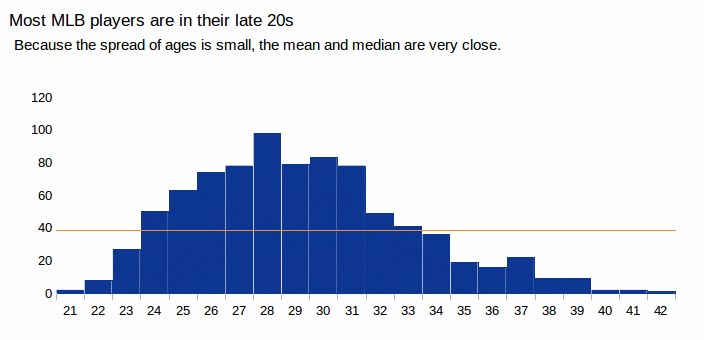

# Math for <nobr>Journalists</nobr>

&copy; 2013 Ben Lesser and Amanda Hickman <a rel="license" href="http://creativecommons.org/licenses/by-nc-sa/4.0/"> </a>

--v--

## Why?
* So you won't be wrong.
* So you're harder to lie to.
* So you can write better, more accurate stories. 
* So you can challenge your sources and check their claims. 

NOTES: 
You're going to look at numbers in your career. I don't care if they're box office statistics or drug use trends or municipal budgets or inseams. 

And you're going to need to spot numbers that don't make any sense at all. 

--v--

## Fundamentals
  
Rounding Off  
Means and Medians   
Percent of a Whole   
Percent Change   
Other kinds of rates
Means and Medians  
Writing about Comparisons  
Inflation  
Margin of Error  
Sampling  

NOTES:
This is our roadmap. 

-----

## Rounding

>"The analysis, released on Monday by the Metropolitan Policy Program of the Brookings Institution, also found that while the number of poor people in New York City and Newark declined by 7 percent, or 120,000, the number in the suburbs rose by 14 percent, or 100,000, from 2000 to the census's rolling 2008-10 American Community Survey."

[Suburbs' Share of Poor Has Grown Since 2000](http://www.nytimes.com/2013/05/20/nyregion/suburbs-are-home-to-growing-share-of-regions-poor.html)  
Sam Roberts, *New York Times*, May 20, 2013

NOTES:
Some things we know for sure: the number of poor people did not decline by 120,000. The number of poor people did not decline by 7%. The number of urban poor in the greater NYC area is definitely not an even multiple of 10,000. The figure provided by the census is something much closer to 119,258, and that figure is wrong. Even the census has a margin of error. So instead of creating the illusion that we know, to the person, how many people are living below the federal poverty level, we round off. And if we do any calculations with these round figures, we round those calculations off, too.

Most newsrooms have a policy about what to round to, and when you need to use hedge words ("about" / "just over")

--v--

## Rounding

Population below poverty level 2005-2009:  
**39,537,240**

Source: American Community Survey

### Round the '09 poverty count to the nearest million.

What we're really asking is, is 39.5 million closer to:  
**39,000,000** or **40,000,000**? 

<h3>Round to the nearest hundred thousand.</h3>

NOTES:
The '05-'09 American Community Survey found 39,537,240 Americans living below the poverty line (US Census)  The census department knows that number isn't right. They publish it with a margin of error of +/- 250,000 --that means they're fairly certain (95-99% certain, not 100% certain -- we'll get to that) that this particular group is somewhere between 39,287,240 and 39,787,240. So this is a very rough number and giving it to the nearest 10 or 100 suggests far more accuracy than you actually have. 

So, how do you round off the 2009 poverty count to the nearest million?

Most newsrooms will have a policy. So ask. 

What if we wanted to round this to the nearest…
* Ten thousand?
* Thousand? 

I usually try to keep two significant digits.

-----
## Median vs. Mean
**How do you find the "mean" value in a set of numbers?**

 Add all the values and divide by the number of values.

**How do you find the "median" value?**

Order the values and select the middle value. If there are an even number of values, take the mean of the middle-most two.

NOTES:
Next item: Means and Medians. 

You also went over this in Fundamentals so it shouldn't be new. 

When people say "average" what they usually mean is "mean".

--v--
## Median vs. Mean

**Two Days in November, 2013**

430000  
187000  
230000  
245000   
155000   
420000  
462500  
90000    
145000  
150000  

Source: Street Easy, Nov 2013

NOTES:
I pulled up a list of recorded real estate sales for a week in late October/Early November.  There were just 10 coops on that list. How would we find the median?

Median: 208500
Mean: 251450
--v--
## Median vs. Mean

90000  
145000  
150000  
155000  
187000 **<--#5**  
230000 **<--#6**  
245000  
420000  
430000  
462500  

Source: Street Easy, Nov 2013

NOTES: 
There are 10 values, so there isn't a middle value. So we need to know the number halfway between 187K and 230K. There's a spreadsheet with all of these values that you can play with. 

Median: 208500
Mean: 251450

--v--
## Median vs. Mean

**Mean** MLB Salary $3,893,623.79

**Median** MLB Salary $1,475,000.00

Source: [Baseball salaries for 2014](http://sports.newsday.com/long-island/baseball/mlb-payroll-and-salaries/), *Newsday*

NOTES: 2013 MLB Salaries range from $480,000 (a handful of low-paid players) to $29,000,000 (Alex Rodriguez). 46% of players earn less than $1 million, but about 100 earn more than $10 million. That's a pretty big spread. 

Most people mean "mean" when they say average. But sometimes the mean isn't an accurate representation of the typical experience. But the second lowest paid player gets around 400,000 and he's got a lot of company. Out of 864 players, a handful earn more than $10,000,000 (actually, I spot checked these numbers on baseball-reference.com and it seems like they're all wrong. 

So, the median is probably a better figure to represent the typical salary. 	

Source: http://data.newsday.com/long-island/data/baseball/mlb-salaries-2013/

--v--
## Median vs. Mean

**Mean** MLB age 29.18

**Median** MLB age 29

Source: [Baseball salaries for 2014](http://sports.newsday.com/long-island/baseball/mlb-payroll-and-salaries/), *Newsday*

NOTES: Meanwhile, the ages of MLB players range from 21 to 42. There aren't  a lot of 21 year olds or 42 year olds. So it isn't a surprise that the mean and median are pretty close.  In cases where there aren't a lot of outliers, you can use the mean which for most people is the same as the average. 
--v--
## Median vs. Mean
Use the median when outliers would distort the mean, or when your values have no ceiling or no floor (real estate, CEO salaries)

Otherwise, use the mean.

NOTES:
Most people use "average" and "mean" interchangeably, so that is what people expect.

--v--
## Median vs. Mean

| Rooms      | Count    |
|---|---|
| No bedroom | 47318    |
| 1 bedroom  | 264585   |
| 2 bedrooms | 759549   |
| 3 bedrooms | 1081713  |
| 4 bedrooms | 385004   |
| 5 or more  | 91065    |

### Can we calculate the mean?
<aside class="notes"
NOTES:
This one came from an actual reporter on the NICAR list. I have data on the number of housing units broken down by number of bedrooms. How do I calculate the median number of bedrooms? Obviously I can add up all the bedrooms and divide by the total number of homes to get an average, but I want the median: 

No bedroom 47,318  1 bedroom 264,585  2 bedrooms 759,549  3 bedrooms 1,081,713  4 bedrooms 385,004  5 or more bedrooms 91,065

So how do we calculate that? (We add them all up, find the halfway point, and then say "is 0 more than half? (no) is 0 +1 more than half (no); is 0 + 1 + 2 more than half? (no)" 0+1+2+3 is more than half which means that the median is 3.

NYPD Salaries vs. Takehome Pay; Walmart salaries; look for hedge words. 

Walmart Notes: http://makingchangeatwalmart.org/factsheet/walmart-watch-fact-sheets/fact-sheet-wages/; http://www.gothamgazette.com/index.php/economy/694-is-wal-mart-worse ; http://www.payscale.com/research/US/Employer=Wal-Mart_Stores%2c_Inc/Salary ; http://america.aljazeera.com/articles/2013/11/6/calif-walmart-workerscallformorehoursbetterpay.html ; http://corporate.walmart.com/our-story/working-at-walmart/opportunity-benefits 
</aside>
-----

## Percent of the Whole
The 2009 American Community Survey found **39,537,240** living below the poverty line, in a country of **308,745,531**. What percent of Americans live below the poverty line?

<http://bit.ly/craft_math>

Divide the subset **by the whole group:**    
39,537,240 / **308,745,531** 
= .12805769162696

Multiply by 100:
 12.805769162696%  
And round off:
13%  

NOTES: 
That figure in the abstract doesn't tell us much. What we'd really like to know is how that compares to the population as a whole. So how do you calculate that? Go ahead and write it down. 

Go to http://bit.ly/craft_math  to get exact digits, or round off. Use a calculator.

What this really tells us is that for each person in the country, there are .13 people living in poverty. So we multiply by 100 to get the "percent" or "per hundred"

Is this really the figure we're going to publish? 12.805769…? No. 

So how would we round that off to the nearest … hundred thousanth? ten thousandth? hundredth? Tenth? Whole number?

--v--
## Percent of the Whole
1 = 100%    
½ = 1 ÷ 2 = 0.5 = 50%  
⅓ = 1 ÷ 3 = 0.333333 = 33%  
⅝ = 5 ÷ 8
 &nbsp; = 0.625
 &nbsp; = 63%  

NOTES:
These are all things we know.

You know this. If you don't, speak up.   What about 5/8ths? What % is that?

You know this, too. You might not know that 5/8 is 63% but you know how to get there.

--v--
## Percent of the Whole
Cory Booker collected over $9 million to fund his 2013 Senate campaign. Quite a bit of that money came from outside of NJ: 

| Total donations:        | $9,296,364 |
|---:|---:|
| Donations from CA:      | $1,576,301 |
| &nbsp;  &nbsp; from NJ: | $2,535,181 | 
| &nbsp;  &nbsp; from NY: | $3,013,305 |

###What percent of Booker's donations came from California?

What else do we want to know to put that figure in context?

NOTES:

What percent came from CA? What percent from out of state? Do the math and then let's talk about it. Links at http://bit.ly/craft_math including the data.  CA donor 17% / NJ donor 27% / NY donor 32%

What % of donors came from NJ? From Outside NJ? Is that noteworthy? 

Open Secrets/Center for Responsive Politics has some of this data: http://www.opensecrets.org/races/geog.php?cycle=2014&id=NJS2&spec=Y /  Bulk FEC data: http://www.fec.gov/finance/disclosure/ftpdet.shtml#2013_2014 / Also available per candidate: http://www.fec.gov/finance/disclosure/candcmte_info.shtml 

--v--
## Percent of the Whole
>"All in all, there are about **14,000**  domestic infant adoptions a year, comprising only about **15 percent** of U.S. adoptions. (The rest are from the foster care system, or are international.)" 

[Meet the New Anti-Adoption Movement](http://www.newrepublic.com/article/114505/anti-adoption-movement-next-reproductive-justice-frontier)  
Emily Matchar, *The New Republic*, Sep 1, 2013

### What percent of adoptions are not domestic infant adoptions? 
100 - 15 = 85

--v--
## Percent of the Whole
>"All in all, there are about **14,000**  domestic infant adoptions a year, comprising only about **15 percent** of U.S. adoptions. (The rest are from the foster care system, or are international.)" 

[Meet the New Anti-Adoption Movement](http://www.newrepublic.com/article/114505/anti-adoption-movement-next-reproductive-justice-frontier)  
Emily Matchar, *The New Republic*, Sep 1, 2013

### How many adoptions are there each year in total?

14,000 is 15% of … what?   
14,000 = 0.15 `*` x  
(14000)/0.15 = x  
x = 93,333.333333  
x = **93,333**  

NOTES: 
Why are we doing all this? Because you need to be able to do some quick back of the napkin math when you're talking to sources. How do we take a statement like this and go back to the source (or, in this case the writer) and say, "Do you mean to tell me ..." 

This surprised me. I don't actually know that much about international adoption but I've always roughly understood that it is rare for kids to be adopted out of foster care, and I didn't realize that international adoptions so thoroughly dwarf domestic adoptions. 

You know how to get a % -- how do you get back from a % to a whole number? Write down the formula you'd use to calculate US Adoptions in total.

"percent" just means "per hundred" so 15% is the same as 0.15

So to solve for X, we're just using algebra. What's our next step? Divide both sides by 15 percent.

Do the math: we can round that down to 93,000.  So she's saying there are a little more than **93,000** adoptions last year, and 15% were domestic infant adoptions. So how do we figure out how big that other group is. We have two options.

--v--
## Percent of the Whole

>"All in all, there are about **14,000**  domestic infant adoptions a year, comprising only about **15 percent** of U.S. adoptions. (The rest are from the foster care system, or are international.)" 

[Meet the New Anti-Adoption Movement](http://www.newrepublic.com/article/114505/anti-adoption-movement-next-reproductive-justice-frontier) Emily Matchar, *The New Republic*, Sep 1, 2013

### How many other adoptions are processed each year?  

 Subtract:  
93,333 - 14,000 = **79,333**  

Or multiply:  
85% of 93,333 = **79,333.05** 

NOTES:
The figures a little bit off because we did some rounding. That's okay. We're going to round this whole thing off. This is the part that I found surprising: **79,000** kids were adopted internationally or out of foster care, and only **14,000** were domestic infant adoptions. That seemed nuts to me, so I did some sniffing around. 

--v--
## Percent of the Whole
In 2012 the state department processed **8668** international adoptions.

In 2011, of the **245,260** children who exited foster care, 20% were adopted. 

How many children were adopted out of foster care? **49,000**

NOTES: 

I googled "How many international adoptions per year" and found a state department site with a statistics link right on their home page. There were **8668** international adoptions in 2012. http://adoption.state.gov / http://adoption.state.gov/content/pdf/fy2012_annual_report.pdf 

I also found a figure for children adopted out of foster care on Wikipedia. They cited a Health and Human Services fact sheet at https://www.childwelfare.gov/pubs/factsheets/foster.pdf  which said this. So how do we find 20% of 245,260? 

What is 20% of 245K?  49,000

That's actually higher than I was expecting, but it still leaves about **20,000** kids unaccounted for.  In this case, she's overlooked a pretty large category: kinship adoptions. Sometimes kinship adoptions happen through the foster care system, but very often, they're aunts or uncles or step-parents legally codifying an existing family arrangement. You don't have to know all this about adoption numbers, unless you're writing about adoptions, but if you're writing about adoption you should be able to check your own math so you don't skip something significant. 

--v--
## Percent of the Whole

| | |
|---:|---:|
|Domestic Infant Adoptions: |  14000   
|All International: | 8668  
|Foster Care Adoptions :|  49000  
|TOTAL: | 71668

But there are ~93,000 adoptions in the US in a typical year.

NOTES:
But our first pass said there were 93,000 adoptions in the US. So something is wrong here. 

And in this case, 30% of kids adopted out of the foster care system are adopted by relatives.  So 15K to 16K of those kids were also adopted by relatives. 

That's actually higher than I was expecting, but it still only gets us to **71,668** cases. You don't have to know anything else to know there's a problem with her statement -- and this is the kind of checking you need to do on sources. In this case, she didn't account for kinship adoptions -- aunts, uncles, step parents legally adopting a child they already care for. As it turns out, 39% of all adoptions in the US are kinship adoptions. Some of those are relatives adopting children who have been in foster care, some are outside the foster care system. 

(I can't find my source for 39%! Terrible record keeping).

This isn't an earth shattering omission and it probably happened in the editing process, but I wanted to get you guys doing this math, because you need to be able to do it. And you need to be in the habit of quickly checking your sources. 
-----
## Percent Change

> In 1980, 40 percent of the population smoked, and in 1990 only 30 percent smoked. 

Wikipedia, so don't quote that figure.

### Calculate the percent change in smoking. 
**Difference / Origin `*` 100** 
or **(old-new)/old `*` 100**

(30 - 40) ÷ 40 = 0.25  
25%

Handy calculator: <http://www.newsengin.com/percentChange.php>

NOTES: 
What do we do when values change? 

* How would you phrase that? Smoking fell by 25%.

We'll come back to this in a bit. 
-----
## Percentage Points

When The New York Sun writes that "Mr. Lhota trails his Democratic rival, Bill de Blasio, by 44 points" they mean "percentage points."

If 64% of voters support de Blasio, what percent support Lhota in this poll? 

*percentage points:* the arithmetic difference between two percentages.

How is this different from saying Lhota is 44 percent behind de Blasio, or deBlasio leads by 44 percent? 

NOTES:
Percentage Points are not percents. 

They mean that if 20% of voters support Lhota, 20+44 = 64% of voters support deBlasio.

If we wanted to say that deBlasio leads by 44%, we have to ask, "of what" and if we're saying "of Lhota's support" then we're saying a very different thing. 

We use percentage points when what is really important is the spread between two figures. 

-----
## Rates
*per capita*  - for each person  
*percent* - for each hundred  
*per 100,000* - for each hundred thousand  

NOTES:

We've talked a bit about percents -- that is really just a rate per 100. 
per (preposition, taking the accusative case, meaning "by, by means of") and capita (accusative plural of the noun caput, "head").

"capita" comes from the latin word for "head" ; "cent" is the latin 

http://en.wiktionary.org/wiki/per_capita 
Rates aren't always per 100,000. NY State nursing homes tracks records per 100 occupied beds. 
http://nursinghomes.nyhealth.gov/nursing_homes/complaints/434
 
--v--
## Rates

| City | Number of Murders |
|:---|---:|
|New York City|419
|Denver|39

NOTES: Percents are one rate -- the rate per 100. But I want to talk about some other rates. I know you guys covered this in Fundamentals. So it ought to be pretty fresh in your minds.

If I just tell you that there were **39** murders in Denver last year, **419** in NYC, is that useful information?

Some things you measure "per capita" – which just means "per person" or literally "per head". If there are more things than people, that's great. Pounds of sugar per capita. GDP per capita. But there is a fraction of a murder for each person in a city so we look for a more manageable rate. Per 100,000 is fairly typical. 

--v--
## Rates

In NYC in 2012, there were **419** murders. NYC's population is **8,289,415**. What was the murder *rate* in 2012? 

419 ÷ 8289415 = 0.00005054639

0.00005054639 * 100,000 = 5.1

Murder rate: 5.1 per 100,000
		
NOTES: 
How would you calculate that? 

Rate per 100,000:		
incidents/population x 100,000

So let's calculate this out.  We want the rate per **100,000**  people which we get by dividing the total number of incidents by the population as a whole and multiplying by 100,000. 

Start by dividing the number of murders by the population, what do we get?

5.054639 E-5 or 0.00005054639 

(You might get E Notation https://en.wikipedia.org/wiki/Scientific_notation) 
So for every person there was a small fraction of  a murder. It is a bit more useful to know how many murders there were for every 100,000 people, so multiply by 100,000

If we divide the number of murders by the population, what do we get? 5.054639 E-5 or 0.00005054639

That's not a useful figure at all.  And if we want to make this a % we won't do much better: .005% of New Yorkers were murdered last year. On the whole, that is a good thing. But as a number to compare against other cities, it is still buried. So we multiply by 100,000

(You might get E Notation https://en.wikipedia.org/wiki/Scientific_notation) 
So for every person there was a small fraction of  a murder. It is a bit more useful to know how many murders there were for every 100,000 people, so multiply by 100,000

(If you rounded to 8.3 million you'll get 5.0482)

--v--
## Rates

| City         | Count | Rate per 100,000 |
|:---|---:|---:|
|New York City | 419   | 5.1
|Denver        | 39    | 6.2

NOTES: 
As it turns out, the murder rates in Denver and NYC are pretty close, but you're just a bit more likely to be murdered in Denver. 

-----
## Percent Change

 | FDNY Rank       |  Base     | Fringe  | Total
 |---|---|---|---
 | STARTING SALARY |  $39,370  |  $3,704  | $43,074
 | AFTER 1 YEAR    |  $41,311  |  $8,159  | $49,470
 | AFTER 2 YEARS   |  $44,995  |  $8,886  | $53,881
 | AFTER 3 YEARS   |  $49,494  |  $9,775  | $59,629
 | AFTER 4 YEARS   |  $54,556  | $10,775  | $65,331
 | AFTER 5 YEARS   |  $76,488  | $22,616  | $99,104 
 | Lieutenant      |  $94,300  | $31,548  | $125,848
 | Captain         |  $108,244 | $40,919  | $149,163
 | Battalion Chief |  $140,945 | $20,336  | $161,281

[FDNY](http://www.nyc.gov/html/fdny/html/community/ff_salary_benefits_080106.shtml), retieved Sept 2013;  Fringe benefits reflect overtime, holiday pay and other differentials.

*[Fringe]: Fringe benefits reflect overtime, holiday pay and other differentials

NOTES: 
  
FDNY publishes a bunch of data on what firefighters earn. So if I want to know how much my base salary is going to increase after five years, I need to calculate percent change. How do we do that?

--v--
## Percent Change

| FDNY Rank       |  Base     | Fringe  | Total
|---|---|---|---
| STARTING SALARY |  $39,370  |  $3,704  | $43,074
| AFTER 5 YEARS   |  $76,488  | $22,616  | $99,104 

### What is the % change in *base* salary after 5 years?
Difference:  
76488-39370 = **37118**    
Origin: **39370**

37118 ÷ 39370 = 
0.942799086  
Rounded: **94%**

NOTES:
We need to know what the difference is, first. And then we need to know what percent of our starting point that represents. 

So here's another question: does it make more sense to say that by the time you've been a fire fighter for five years, you've nearly doubled your salary? Or to say it increases by 94%?

Do it again, for the averge total salary:

(99104 - 43074) ÷ 43074 = 1.3,
130%

--v--
## Percent Difference

| FDNY Rank       |  Base     | Fringe  | Total
|---|---|---|---
| AFTER 5 YEARS   |  $76,488  | $22,616  | $99,104 

### What about the difference between base and total?

Difference:  **22616**    
Origin: **76488**

22616 ÷ 76488 = 
0.295680368  
Rounded: **30%**

22616 ÷ 99104 = 0.2282 or 23%

NOTES:

A five year veteran typically makes 30% more than his base salary. But $22,616 isn't 30% of his final salary. It's 23% of his final salary. 

--v--
## Percent Change
>"Jewish Guild for the Blind President Alan Morse saw his total compensation jump **[HOW MUCH?]** from $843,502 in 2008 to 1.5 million in 2009 ..."

[Bosses at health-care charities pulling in six-figure salaries with help from taxpayers](http://www.nydailynews.com/news/bosses-health-care-charities-pulling-six-figure-salaries-taxpayers-article-1.953893)  Ben Lesser, *New York Daily News*, Sep 25, 2011

### How much? 

Note: actual salary in '09 was $1,535,200 so use that.

(1535200 - 843502) ÷ 843502 = 
0.82003125

**82%**

NOTES:
Ben Lesser wrote a story on non profit salaries for the Daily News. He didn't round off, though he probably should have. Especially since the '09 salary was actually $1,535,200. He had to work in a lot of salary data. Do the math here. What was the % change in Morse's salary?

--v--
## Percent Change
>"Three fatal shootings in the last two days pushed Newark's homicide total to 29 this year, a 71 percent jump in killings compared with the same period in 2010, as violent crime surges following police layoffs."

[In wake of police layoffs, Newark murder rate soars as violent crime increases](http://www.nj.com/news/index.ssf/2011/04/newark_homicides_up_64_percent.htm) James Queally, Newark Star-Ledger, Apr 26, 2011

How many fatal shootings during the same period last year? 

0.71 = (29 - X) ÷ X   
0.71X = 29 - x    
1.71X = 29   
X = 16.95906  
**17 fatal shootings**

NOTES: 
This is the kind of story you wind up having to write constantly. Not for nothing, the URL for this story was "http://www.nj.com/news/index.ssf/2011/04/newark_homicides_up_64_percent.html" -- so someone had to do their math over after the story went out.

I find it much easier to talk about the "difference" than "old-new" precisely because when a number rises, the percent change is negative. If new is greater than old, then old - new is less than zero, by definition. So knowing that we're looking for the difference makes it easier. If you do old-new, and use a positive percent, you wind up with 100 murders in 2010, which is logically not right.

--v-- 
## Percent Change

Base salary: $32,000   
10% Raise: 32000 + 0.10(32000)  
New salary: $35,200   
10% Reduction:  35200 - 0.10(35200)   
Final salary: $31,680 

> When the basis of your comparison changes, everything changes. 

NOTES:
The denominator makes a difference. If someone makes $32,000, and they get a 10% raise, that raise is $3200. If their salary subsequently drops by 10%, the reduction is 10% of that new higher salary, or $3520. So the reduction brings the salary down to $31,680.

My new salary is 10% more than my old salary. But my old salary is not 10% less than my new salary. My old salary is 9% less than my new salary. 

(35200-32000)/35200 = .090909 or 9%

-----
## Inflation

### What is inflation? 

NYT changes stylebook today to bar uses of &quot;record&quot; or &quot;largest&quot; unless inflation is taken into account.
&mdash; David Leonhardt (@DLeonhardt) <a href="https://twitter.com/DLeonhardt/statuses/393079818800988160">October 23, 2013</a>

&quot;This is not statistical quibbling. It is simply not accurate to describe $1,000 in 2013 dollars as “more” money than, say, $900 in 1960...&quot;
&mdash; David Leonhardt (@DLeonhardt) <a href="https://twitter.com/DLeonhardt/statuses/393079929992003584">October 23, 2013</a>

NOTES:
What is inflation? 

David Leonhardt is now the ME of The Upshot, but I think he was still the NYT Economics columnist when the paper made this change. 

Notes/ not using: if you try to argue that beer prices have gone up as a result of industry consolidation (actually, they've followed the price of other foods and beverages). http://www.motherjones.com/kevin-drum/2013/08/beer-inflation  or household spending (which has plummeted) http://www.motherjones.com/kevin-drum/2012/09/why-you-should-always-account-inflation-case-study  or government spending
http://www.motherjones.com/kevin-drum/2013/08/repeat-after-me-always-adjust-inflation-always-adjust-inflation  without adjusting for inflation
--v--
## Inflation

> Inflation: a continual increase in the price of goods and services over time. As a result, a single dollar buys a little bit less stuff today than it did a year or two ago.

Comparing spending or prices over time without adjusting for inflation is useless at best. Sometimes it is plain dishonest. 

Bureau of Labor Statistics inflation calculator
<http://www.bls.gov/data/inflation_calculator.htm>

NOTES: Using "nominal" prices -- prices that aren't adjusted for inflation -- is the equivalent of saying that I'm older now than I've ever been before. It leads to being wrong: http://www.cjr.org/the_audit/misleading_and_incomplete_cove.php

So how do we account for inflation? The BLS has a calculator. 

We have to be able to talk about changing prices  http://www.npr.org/blogs/money/2010/10/22/130757997/the-friday-podcast-the-price-of-lettuce-in-brooklyn 

--v--
## Inflation
> "I had to go late at night and pay $800, a fortune at the time." -- Michelle describing her experience in 1968

[New York Magazine](
http://nymag.com/news/features/abortion-stories-2013-11/index9.html), November 2013

Bureau of Labor Statistics inflation calculator
<http://www.bls.gov/data/inflation_calculator.htm>

NOTES:
New York Magazine has a powerful package on abortion in the Nov 18, 2013 issue. I read most of the profiles in a fit of procrastination, including one from Michelle, who paid $800 in 1968. So here's my question: was that a lot of money? 

http://nymag.com/news/features/abortion-stories-2013-11/index9.html | http://www.bls.gov/data/inflation_calculator.htm 

Better: in 1999, I was a Nation intern. My recollection is that we got paid $150/week. I recently heard that the intern stipend is still $150/week. I was pretty aghast. Put this in perspective for me. 

--v--
## Inflation

[After six budget showdowns, big government is mostly unchanged](http://www.washingtonpost.com/politics/after-six-budget-showdowns-big-government-is-mostly-unchanged/2013/08/23/97d90578-0068-11e3-9711-3708310f6f4d_story.html)
NOTES:
This chart is from a Washington Post story "After six budget showdowns, big government is mostly unchanged" (David A. Fahrenthold, Washington Post, August 23, 2013). He actually did adjust for inflation, just not in his chart. 
"After 2½ years of budget battles, this is what the federal government looks like now: It is on pace, this year, to spend $3.455 trillion.
That figure is down from 2010 — the year that worries about government spending helped bring on a tea party uprising, a Republican takeover in the House and then a series of ulcer-causing showdowns in Congress. But it is not down by that much. Back then, the government spent a whopping $3.457 trillion."
According to Kevin Drum, adjusted for inflation and population growth, federal spending has declined by 8 percent since 2010. In current dollars, it's fallen from $11,800 to $10,900 per person.
-----
## Margin of Error
> "65 percent of likely voters said they will vote for de Blasio, compared to 24 percent for Lhota, a new NBC 4 New York/Wall Street Journal/Marist poll shows." 

NBC 4 New York, Nov 4, 2013

They gave a *margin of error of ± 4.3 percentage points*

**What does that mean?**

de Blasio support is probably between 61.3 percent and 69.3 percent

NOTES: 
Researchers use polling to forecast unknowns. Future election results, the weather, economic change. Usually, they use a margin of error to convey the certainty of their prediction. 

http://www.nbcnewyork.com/news/local/Bill-De-Blasio-NYC-Mayoral-Race-Marist-Poll-Joe-Lhota--230418191.html

How do you calculate the margin of error? You don't. You let statisticians do that. 

Sometimes the margins overlap. That is something, but it isn't everyting. 
http://articles.dailypress.com/2013-11-06/news/dp-nws-polls-20131106_1_republican-ken-cuccinelli-greg-habeeb-cnu-poll
http://web.mit.edu/newsoffice/2012/explained-margin-of-error-polls-1031.html
http://www.cnn.com/2012/11/04/politics/margin-of-error-campaign-foreman/index.html 
http://www.cnn.com/2012/11/05/politics/inside-the-polls/index.html 

--v--
## Confidence Interval
Most surveys have a confidence interval of 95 percent: if the survey were conducted 100 times that result would fall within the margin of error 95 times.

> "A confidence interval is a range around a measurement that conveys how precise the measurement is."

NYS Department of Health

NOTES: 
Did you notice that I said deBlasio support is *probably* between 61.3% and 69.3%? So not only does the margin of error give us some wiggle room, most surveys also have a confidence interval to account for: whoever conducted the survey is only 95% sure that you'll get the same result over and over. That's pretty good, but it isn't 100%. 

When we say all data is bad, this is part of what we're talking about. 
-----
## Sampling

Online poll: Should horse-drawn carriages be banned in NYC? <a href="http://t.co/C4wiGEyhmu">http://t.co/C4wiGEyhmu</a> &#10;Please vote!
&mdash; Mark Hawthorne  (@markhawthorne) <a href="https://twitter.com/markhawthorne/statuses/448461057523077120">March 25, 2014</a>

NOTES:
What they're really saying here is "If you're interested in horses, pass it on." That's great. 

--v--
## Sampling
 

NOTES:
In the winter of 2010, New York City got hit with a monster snow storm halfway between Christmas and New Years. The MTA leadership was all home with their families, there were rumors that Bloomberg was in the Bahamas. Busses were sent out into the blizzard with no chains, they got stuck and couldn't move, snowplows got stuck behind them. It was pretty much a fiasco. 

WNYC started collecting reports of unplowed streets and quickly mapped a handful of streets that hadn't been plowed yet.  http://www.wnyc.org/story/105465-2-mapping-storm-clean/

FWIW, John Keefe, at WNYC, who built this map, was the first one to use it in a story about what crowdsourcing does and doesn't show you. There are lots of good reasons to undertake a crowd sourcing project like this. But don't mistake this for a statistically useful sample. 

--v--

##Sampling

NOTES: 
I grabbed a list of 311 complaints about snow made between 12/25/2010 and 1/1/2011 and mapped those. So is this a comprehensive map of plowed and unplowed streets? (blues are unplowed; grey is sidewalk complaints). Nope. It's a map of 311 calls. But it is a better snapshot of the snow situation in the city. 
</aside>
--v--
## Sampling

NOTES:
You'll come across a lot of polls in your career. Some are rigorous and reliable and some are totally bogus. You want to know what he pollsters asked and how they chose their samples. You want to know who paid for the study and what their agenda is. Survey design is complex.  You aren't statisticians. Unless you are, in which case you already know all of this. Otherwise, you need to find help.

The Pew research center did a great analysis about the order of questions: they found that if you ask people how they feel about gay marriage before you ask them how they feel about civil unions, they're more likely to say they favor civil unions. (this is from 2003 -- I'd gues the data is different today.)They repeated this with questions about Bush's record, congress working together. All kinds of things. 

Even the order of questions matters: http://www.people-press.org/methodology/questionnaire-design/question-order/

--v--
## Sampling

Sampling refers to the process of selecting a random and representative subset of the larger population to determine the characteristics of the whole population.

Online polls are self selected. They represent the group of people who heard about the poll.

Size of sample determines the margin of error

A good pollster will tell you what their sample size was. They can tell you what their methodology was.

-----
## Writing with Numbers
You are the decider.

NOTES:
Don't use every number just because you have them.
--v--
## Writing with Numbers
fewer things, less stuff

NOTES:
Use "fewer" for things you can count: lumps of sugar, cars, people. Use "less" for things you can't count: milk,  traffic, homework. 

Dollar bills are countable, but dollar amounts are not. Years are countable, but ages are not. Confused? Refer to the AP Style book. 

You could, if you wanted, get into a long semantic debate about whether or note statements like "one less car" are grammatically correct. Knock yourself out. We don't traffic in theory. AP style says fewer things, less stuff. 

--v--
## Writing with Numbers
1. Less than 10 applicants showed up. 
1. I have less than $20.
1. She is fewer than 60 years old. 
1. There were far fewer dogs in the park today.
1. The mayor wants less people to go hungry.

NOTES:
Use "fewer" for things you can count: lumps of sugar, cars, people. Use "less" for things you can't count: milk,  traffic, homework. 

Dollar bills are countable, but dollar amounts are not. Years are countable, but ages are not. 

1. WRONG. Applicants countable: should be fewer.
2. RIGHT. I could say I have "fewer than 20 quarters" but $20 is an amount. So use less.
3. WRONG: years refers to a period of time, not to individual years, Should be less.  Or you can just edit it to say that she's not yet 60. 
4. RIGHT. you can count dogs. 
5. WRONG: this is about individuals, so say fewer. 

There are a ton of exceptions, too, just to keep you on your toes: 
http://afterdeadline.blogs.nytimes.com/2011/03/01/fewer-vs-less
--v--
## Writing with Numbers
> Earnings: Among the major race and ethnicity groups, Hispanics and Blacks had considerably lower earnings than Whites and Asians. In 2012, the median usual weekly earnings of full-time wage and salary workers were $568 for Hispanics, $621 for Blacks, $792 for Whites, and $920 for Asians. Among men, the earnings of Whites ($879), Blacks ($665), and Hispanics ($592) were 83, 63, and 56 percent, respectively, of the earnings of Asians ($1,055). The median earnings of White women ($710), Black women ($599), and Hispanic women ($521) were 92, 78, and 68 percent, respectively, of the earnings of Asian women ($770). (See table 16.)

NOTES:
The BLS gives us this nonsense. If we all wanted to read BLS reports, we wouldn't need journalists to cover labor. So your job is to decide what numbers here are noteworthy or remarkable. 

http://www.bls.gov/cps/cpsrace2012.pdf

--v--
## Writing with Numbers
1. Don't overwhelm the reader: choose the numbers that matter. 
1. Use visuals to tell the rest of the story
1. Don't hesitate to contact an expert if you are uncertain (find someone to turn to)
1. Always double check your math.
1. ALL DATA IS BAD!

NOTES: 
Your job is to tell me, the reader, what is important here. Not to hit me over the head with numbers. 

If I need to see the figure for every month in the last year for four cities, make a chart. Don't rattle off numbers.

Know that numbers are always wrong, know the difference between what the numbers tell you and what they don't. The very day that NYC announced that we're on track for a record low homicide rate in the city, Gothamist ran a story on it, sandwiched between an enraged bronx driver who ran someone over on purpose (but won't be logged as a homicide) and child who was killed by a speeding car in Fort Greene. Especially when we're talking about things that are hard to change, like access to clean water, or crime rates, if you're the one keeping the numbers it is always easier to redefine "access" (or "clean water") than to change access. 
</aside>
--v--
## Writing with Numbers

<table><tr><td>

</td><td>&nbsp;</td><td>

</td></tr></table>

How much less?

NOTES:
How much less, or how many fewer? Think of it in terms of cookies, first.

If you have one cookie, and I have two, there isn't much confusion. I have 100% more cookies. Twice as many. One more. 

If I say I have one more cookie, you know that the number of cookies I have is 1 + however many you have: it is a statement about the difference between how many cookies we each have.  That's not hard. 

--v--
## Writing with Numbers

<table><tr><td>

</td><td>&nbsp;</td><td>

</td></tr></table>
Image courtesy of Bob Smith, Wikimedia Commons

NOTES: 
Three times as many cookies
But if you have two cookies, and I have six, I have:

...three times as many cookies – the number of cookies you have, times three is the number of cookies I have.

...four more cookies. And since four is 200% of two, I have
… 200% more cookies. 

This seems pretty obvious, which is why I'm showing it to you.  

--v--
## Writing with Numbers
> 67% fewer cookies

is the same as saying ...

> One third as many cookies

NOTES:
One third as many cookies
And if you have two cookies, and I have six, you have …

… 80% fewer cookies (6 - (6 * .80)) =  

… 4 fewer cookies (or ⅔ fewer, 67% fewer)
… ⅓ as many cookies (or 33% as many)

--v--

## Writing with Numbers
*More, less, fewer:* statements about the difference.

*As many as:* statements about the ratio. 

NOTES:
The Atlantic: who is more likely to be unemployed http://www.theatlantic.com/business/archive/2013/11/the-workforce-is-even-more-divided-by-race-than-you-think/281175/

http://www.bls.gov/cps/cpsrace2012.pdf 

----

## Comparisions

NOTES:
The DOT has a whole campaign that is actually quite puzzling. The gist is straightforward: the speed limit is 30 miles an hour because a person who is hit by a car moving more than 30 miles an hour is a whole lot more likely to die. But what they actually say is this: "Hit at 40 mph, there's a 70% chance I'll die. Hit at 30 mph, there's an 80% chance I'll live."  

And, starting in November the limit will be 25!

--v--
## Comparisons
"Hit at 40 mph, there's a 70% chance I'll die. Hit at 30 mph, there's an 80% chance I'll live."  

| Speed | Fatality  Odds | Survival  Odds |
|---|---|---|
| 40 mph | 70% |  30% |
| 30 mph | 20% | 80% |

NOTES:

So let's take this apart. You get hit by a car, you have two choices: you live, or you don't live. 

"as likely" is a ratio: 70/20 = 3.5 

"more likely" is a statement about the difference: (70-20)/20 = 2.5

So is "less likely": (20 - 70)/70 = 0.71

So let's take this apart. You get hit by a car, you have two choices: you live, or you don't live. So everyone take a moment to write some sentences about speeding. 

-----
## Comparisons

<a href="https://twitter.com/DNAtv">@DNAtv</a> <a href="https://twitter.com/hashtag/marijuana?src=hash">#marijuana</a> use is roughly equal among Black and whites, yet Blacks are 3.73 times as likely to be arrested for possession <a href="https://twitter.com/hashtag/DNAtv?src=hash">#DNAtv</a>
&mdash; Daisy Vieyra (@VieyraDaisy) <a href="https://twitter.com/VieyraDaisy/status/395232363019390977">October 29, 2013</a>

NOTES: 
ACLU Report https://www.aclu.org/billions-dollars-wasted-racially-biased-arrests 
https://www.aclu.org/sites/default/files/assets/100413-mj-report-rfs-rel1.pdf (NY page 169) 

In 2010, nationwide the white arrest rate was 192 per 100,000 whites, and
the black arrest rate was 716 per 100,000 blacks. -- page 17 
716/192 is 3.72 -- as likely. Their summary gives a "more likely" figure. 

NYT changed it to "as likely" 
http://www.nytimes.com/2013/06/04/us/marijuana-arrests-four-times-as-likely-for-blacks.html

--v--
## Comparisons
 

(rates are per 100,000) / [The War on Marijuana in Black and White: Report](https://www.aclu.org/criminal-law-reform/war-marijuana-black-and-white-report), ACLU June 2013

NOTES:
In 2010, nationwide the white arrest rate was 192 per 100,000 whites, and
the black arrest rate was 716 per 100,000 blacks. -- page 17 
716/192 is 3.72 -- as likely. Their summary gives a "more likely" figure. 

NYT changed it to "as likely" 
http://www.nytimes.com/2013/06/04/us/marijuana-arrests-four-times-as-likely-for-blacks.html

Usage is comparable: http://www.cdc.gov/nchs/data/hus/hus12.pdf#212

--v--
## Comparisons

(rates are per 100,000) / [The War on Marijuana in Black and White: Report](https://www.aclu.org/billions-dollars-wasted-racially-biased-arrests), ACLU June 2013

Find the **difference**:
1192 - 263 = 929  
and divide: 
1192 / 263 = 3.532319392

Or, find the **ratio**:
1192 / 263 = 4.532319392

*and then round off!*
-----
## More Resources
It takes more than numeracy and some skepticism to cover numbers stories. Sarah Cohen's [Numbers in the Newsroom](http://www.worldcat.org/oclc/48822382) is a great primer on a range of numbers-driven stories. She goes well beyond the basics of language and calculation, deep into property taxes, school rankings, and economic forecasts.

Robert Niles' [Statistics Every Writer Should Know](http://www.robertniles.com/stats/) is clear and concise.

Anthony Curtis at UNC Pembroke keeps a running [list of resources](http://www.uncp.edu/home/acurtis/Courses/ResourcesForCourses/Journalism/JournalismMath.html)

--v--   

# Math for <nobr>Journalists</nobr>

&copy; 2013 Ben Lesser and Amanda Hickman. Licensed under a Creative Commons Attribution-NonCommercial-ShareAlike 3.0 Unported license. Contact us to discuss commercial uses. <a rel="license" href="http://creativecommons.org/licenses/by-nc-sa/4.0/"> </a>

Math For Journalists by Ben Lesser and Amanda Hickman is licensed under a <a rel="license" href="http://creativecommons.org/licenses/by-nc-sa/4.0/">Creative Commons Attribution-NonCommercial-ShareAlike 4.0 International License</a>.

